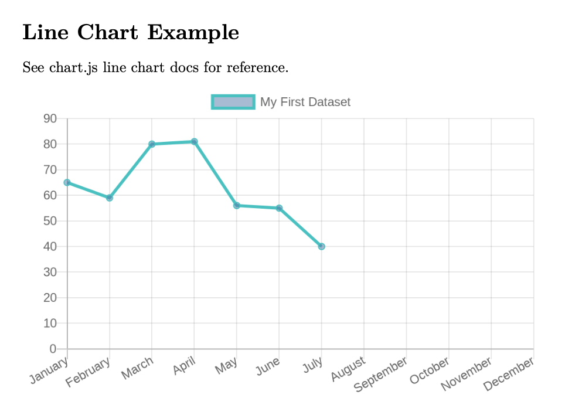

## Setup

To make a clean build and install the filter locally, run
```bash
make build
npm install -g .
```
from this directory.

Check that the filter is available globally by executing `which`. E.g.
```bash
$ which pandoc-chartjs-filter
/Users/main/.nvm/versions/node/v14.17.2/bin/pandoc-chartjs-filter
```

You can also generate example outputs by running
```bash
make examples
```

## Usage
Our _pandoc-chartjs-filter_ expects a [fenced code block](https://www.markdownguide.org/extended-syntax/#fenced-code-blocks) with class _chart_ that contains a chart.js chart specification object in YAML format.
Take a look at the [line chart example](./../examples/line-chart.md) in the examples directory and the chart.js docs for additional information.

Metadata width, height, and output directory can be passed using the extended syntax for fenced blocks. E.g. 
~~~markdown
  ```{#chart width=800 height=600 out=/tmp}
  type: bar
  data:
    labels: [January, February, March, April, May, June, July]
  …
  ```
~~~
The [bar chart example](./../examples/bar-chart.md) contains an example for this.

## Contributing

Enable the precommit hooks by installing [pre-commit](https://pre-commit.com/) and then running.
```bash
pre-commit install
```

The repository contains a Makefile which can be used to build the filter.
```bash
make build
```
The build script will run the TypeScript compiler on the source and put the compiled JavaScript into the _dist/_ folder. Additionally, a shell script will be put into the _bin/_ folder.

Running 
```bash
npm install -g .
```
will install the filter locally for tests.

## Examples

After building and installing the filter, run `make examples` to build the examples and export them to `dist/examples/`

The output should contain be a single page PDF looking similar to this

>  

## Acknowledgements

Thanks to the makers of [Chart.js](https://www.chartjs.org/), **Mike Henderson** for the [pandoc-filter-node](https://github.com/mvhenderson/pandoc-filter-node), and **Sean Sobey** for the [_chartjs-node-canvas_ package](https://github.com/SeanSobey/ChartjsNodeCanvas) 
